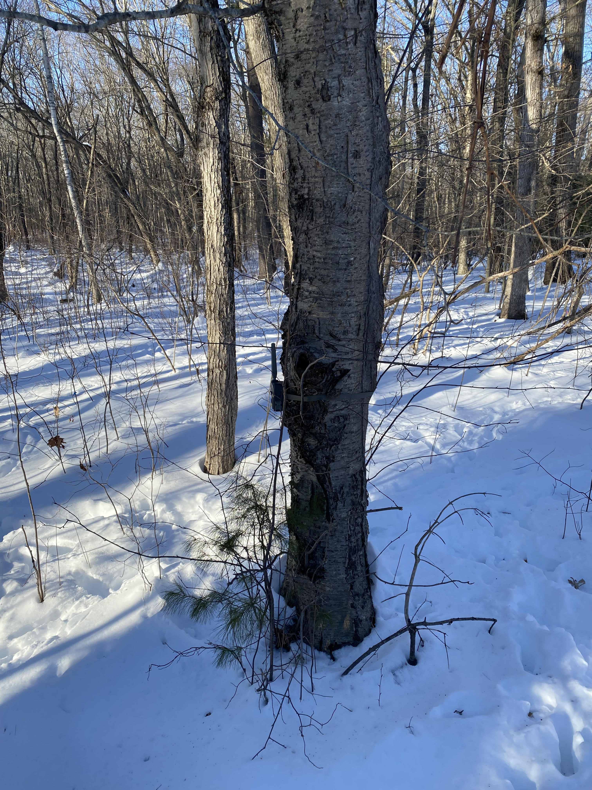
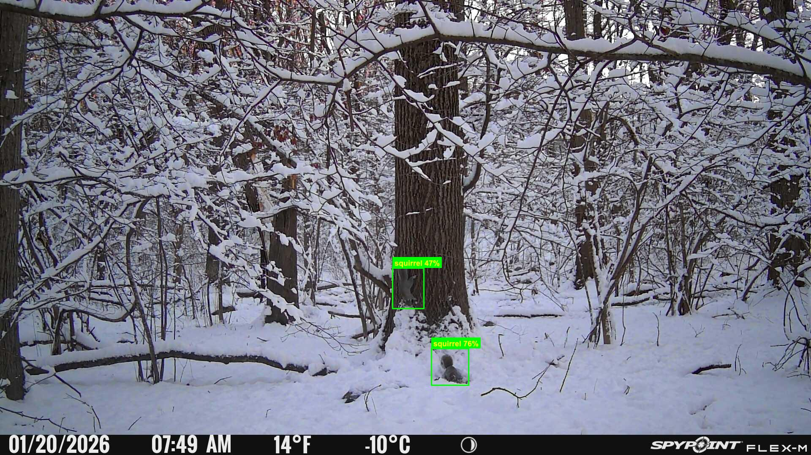

# 🐿️ Squirrel Detector

An Apache Camel Spring Boot application that uses YOLOv8 and DJL to automatically detect squirrels in trail camera images.

---

## The Problem



I have a number of trail cameras set up in the woods behind my house to capture pictures of whatever animals come to the bordering wetlands. I've been checking them for the last six months and I've seen deer, opossum, raccoons, fisher cats, mice, chipmunks, bunnies, coyotes, quite a few bird species, and squirrels. Lots and lots of squirrels.

I see so many squirrels that the large majority of the pictures and videos I've collected are of squirrels. I like squirrels - but the frequency of the squirrel pictures is so great that I'd like to filter my pictures into squirrel and non-squirrel buckets to more easily identify the other animals. Eventually it would be great to build a model that would flag every animal I'm seeing accurately.

---

## The Model

I took my photos and started annotating them with bounding boxes to identify squirrels using [Label Studio](https://labelstud.io/). Once I had enough annotated images, I exported them to YOLOv8, trained a model using Ultralytics, and exported it to TorchScript. The current version of my TorchScript model is included in the `model/` directory.

The model is currently built with 245 images, and I'm gradually improving it by labelling additional images and regenerating the model - I'm getting some false positives and quite a few cases where the model fails to find some squirrels.    I'm hoping with a larger dataset that I'll see more accurate results and eventually when I have enough content, I plan on improving it with identification for other animals.

---

## Build & Run

```bash
# Build
mvn clean package -DskipTests

# Run
java -jar target/squirrel-detector-camel-1.0-SNAPSHOT.jar
```

The application will start and watch the `input/` folder. Drop images in and watch them get processed!

---

## Try It Out

Example trail camera images are included in the `sourceimages/` folder. Copy them into the input directory to test the detector:

```bash
mvn exec:exec@copy-test-images
```

---

## Sample Output



<details>
<summary>📋 Sample console log</summary>

**Startup**
```
 _____  ____  _    _ _____ _____  _____  ______ _
/ ____|/ __ \| |  | |_   _|  __ \|  __ \|  ____| |
| (___ | |  | | |  | | | | | |__) | |__) | |__  | |
\___ \| |  | | |  | | | | |  _  /|  _  /|  __| | |
____) | |__| | |__| |_| |_| | \ \| | \ \| |____| |____
|_____/ \___\_\\____/|_____|_|__\_\_|__\_\______|______|
|  __ \|  ____|__   __|  ____/ ____|__   __/ __ \|  __ \
| |  | | |__     | |  | |__ | |       | | | |  | | |__) |
| |  | |  __|    | |  |  __|| |       | | | |  | |  _  /
| |__| | |____   | |  | |___| |____   | | | |__| | | \ \
|_____/|______|  |_|  |______\_____|  |_|  \____/|_|  \_\

INFO  DjlConfiguration    : Loading model from: model/best.torchscript
INFO  DjlConfiguration    : Model loaded successfully!
INFO  AbstractCamelContext : Apache Camel 4.17.0 (camel-1) is starting
INFO  AbstractCamelContext :     Started squirrel-detector-route (file://input)
INFO  SquirrelDetectorApplication : Started SquirrelDetectorApplication in 1.754 seconds
```

**Detection**
```
📷 Processing: 20260122_100659-1.JPG
🐿️ SQUIRREL DETECTED in 20260122_100659-1.JPG!
   ✅ Original → 20260122_100659-1.JPG
   Found 3 detection(s)
     - squirrel: 82.85%
     - squirrel: 73.96%
     - squirrel: 67.64%
   🐿️🐿️🐿️ 3 squirrels detected, bounding boxes drawn → 20260122_100659-1.JPG

📷 Processing: 20260121_101734-1.JPG
🐿️ SQUIRREL DETECTED in 20260121_101734-1.JPG!
   ✅ Original → 20260121_101734-1.JPG
   Found 1 detection(s)
     - squirrel: 74.56%
   🐿️ 1 squirrels detected, bounding boxes drawn → 20260121_101734-1.JPG

📷 Processing: 20260122_070508-1.JPG
🐿️ SQUIRREL DETECTED in 20260122_070508-1.JPG!
   ✅ Original → 20260122_070508-1.JPG
   Found 1 detection(s)
     - squirrel: 75.77%
   🐿️ 1 squirrels detected, bounding boxes drawn → 20260122_070508-1.JPG
```

</details>

---

## How It Works

```
📁 input/                    Drop images here
      ↓
   🔍 YOLOv8 Detection
      ↓
  ┌────┴────┐
  ↓         ↓
🐿️ Found   🚫 Not Found
  ↓         ↓
📁 output-detected/     📁 output-nodetection/
📁 output-annotated/
```

1. **Watch** - Camel polls the `input/` folder for new images (jpg, jpeg, png)
2. **Detect** - Each image passes through the YOLOv8 model via DJL
3. **Route** - Based on detection results:
   - **Squirrel detected**: Original saved to `output-detected/`, annotated version with bounding boxes saved to `output-annotated/`
   - **No squirrels**: Image moved to `output-nodetection/`

---

## Tech Stack

| Component | Technology |
|-----------|------------|
| Language | Java 17+ |
| Framework | Spring Boot 3.5.9 |
| Integration | Apache Camel 4.17.0 |
| ML Library | DJL 0.36.0 |
| ML Engine | PyTorch |
| Model | YOLOv8 (TorchScript) |

---

## Project Structure

```
squirrel-detector/
├── pom.xml
├── model/
│   └── best.torchscript           # Pre-trained YOLOv8 model
├── sourceimages/                  # Example trail camera images for testing
├── input/                         # Drop images here
├── output-detected/               # Original images with squirrels
├── output-annotated/              # Images with bounding boxes drawn
├── output-nodetection/            # Images without squirrels
└── src/main/java/com/squirreldetector/
    ├── SquirrelDetectorApplication.java   # Spring Boot entry point
    ├── SquirrelDetectorRoute.java         # Camel route pipeline
    ├── BoundingBoxProcessor.java          # Draws detection boxes
    ├── YoloV8Translator.java              # DJL model I/O translator
    └── DjlConfiguration.java              # Spring config for model
```

---

## Configuration

Key settings in `application.properties`:

| Property | Description | Default |
|----------|-------------|---------|
| `detector.model.confidence-threshold` | Minimum confidence for detection | 0.40 |
| `detector.model.nms-threshold` | Non-max suppression threshold | 0.45 |
| `detector.model.input-size` | Model input dimensions | 640 |
| `detector.route.polling-delay` | Folder polling interval (ms) | 1000 |

---

## Trail Cameras

I'm using the following trail cameras:

- SpyPoint Flex-M
- SpyPoint Flex-G36
- GardePro E6
- GardePro E8 2.0
- GardePro A60

---

## Troubleshooting

| Issue | Solution |
|-------|----------|
| Model not found | Ensure `best.torchscript` is in the `model/` directory |
| No detections | Lower `detector.model.confidence-threshold` in `application.properties` (try 0.25) |
| Java version error | Ensure Java 17+ is installed and `JAVA_HOME` is set correctly |
